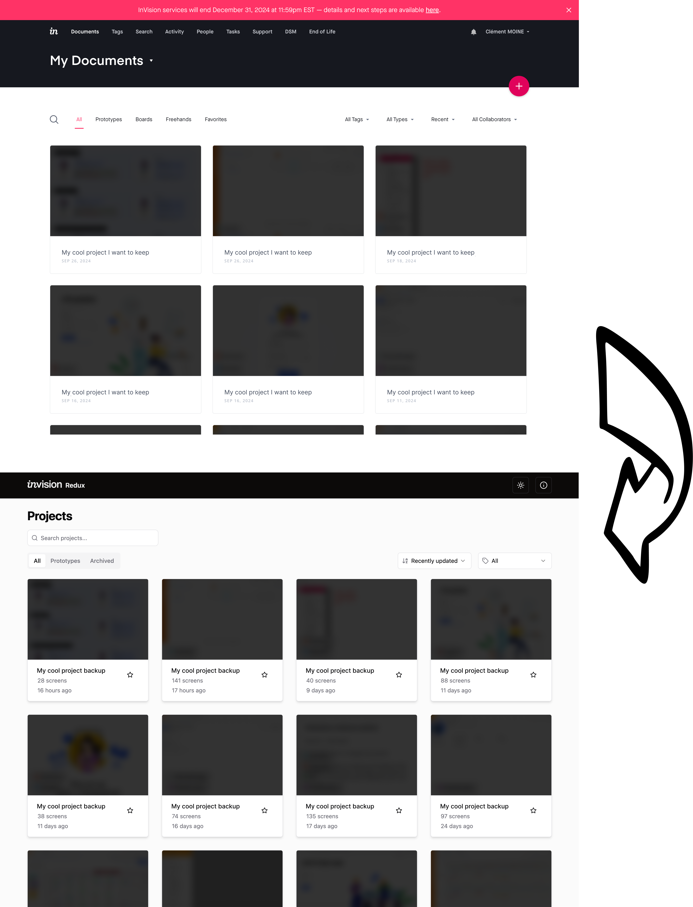

# InVision Redux ⚡️

InVision Redux is a complete app designed to help users backup their projects from InVision before its closure in December 2024. With this tool, users can retrieve all their projects and preserve the prototypes along with their hotspots in complete web application.



> Important note: Nicolas Cage could not be included in the final product (sorry).

## Work in Progress

Some features are not handled yet, here is the not prioritized roadmap/to-do list :

- [ ] Share button (QR Code and url copy to keyboard)
- [ ] Manage all modes (excluding build and comments) :
  - [x] Manage the mode in url
  - [x] Keyboard shortcuts
  - [ ] Preview mode
    - [ ] Quick navigate to a screen with thumbnails (dropdown on the current screen)
    - [ ] Manage the hotspots
      - [x] Navigate to a screen (with id, previous, next or last visited)
      - [x] Display a screen as overlay
        - [x] Fix to permit scroll when overlay is higher than the original screen
        - [x] Open / close overlay
      - [ ] Manage transitions
      - [x] Manage all event types (swipe, long press, double tap ...)
    - [x] Fixed header / footer
      - [x] Display these
      - [x] Manage hotspots in fixed footer and header
      - [x] Fix to follow the horizontal scroll
  - [ ] History mode
    - [ ] Display the screen history
    - [ ] Side by side comparison
  - [ ] Inspect mode
    - [ ] Left panel
      - [ ] List the layers
      - [ ] Select a layer and display annotations and fonts / styles / code etc.
    - [ ] Right panel
      - [ ] Display the fonts / styles / code etc.
      - [ ] Export assets
      - [ ] Variables ? (to be tested, never used that)
    - [ ] Screen panel
      - [x] Display the screen
      - [ ] Display the annotations on hover
      - [ ] Visual select of a layer
    - [ ] Flow mode
      - [ ] Display the screens in a flow chart

Some features are intentionally not meant to be done (at least for the ongoing version) :

- Build mode
- Comments
- Notifications
- Edit in general (rename, settings etc.)
- Upload new screens

## Getting Started

To begin using InVision Redux, follow these steps:

1. **Clone the Repository**:

   ```
   git clone https://github.com/clementmoine/invision-redux.git
   ```

2. **Navigate to the Project Directory**:

   ```
   cd invision-redux
   ```

3. **Install Dependencies and Set Up Environment**:
   Run the following command to install dependencies and set up the environment:

   ```
   make install
   ```

4. **Edit the .env File**:
   The `.env` file is automatically generated during installation. Open the `.env` file located in the root directory of the project and add your InVision email and password in the following format:

   ```
   INVISION_EMAIL=your_email@example.com
   INVISION_PASSWORD=your_password
   ```

   You can also modify other settings as needed.

5. **Run the Scraper**:
   Execute the scraper to generate the necessary documentation files:

   ```
   make scrape
   ```

6. **Review the Exported Projects**:
   Once the scraper has finished running, you can find the exported projects in the `docs` directory. To start the frontend and backend containers serving the documentation:

   ```
   make start
   ```

7. **Stop the Project**:
   To stop the containers, you can run:
   ```
   make stop
   ```

## Debugging and Testing

By default, InVision Redux processes all projects available in your InVision account. However, you can enable a test mode to process only a single project of each type. To enable the test mode, set the `TEST_MODE` environment variable to `True` or `1` in your `.env` file. This can be useful for testing and debugging purposes.

## Note

Please note that InVision Redux is an independent tool developed to assist users in exporting their projects before the closure of InVision's services. It is not affiliated with InVision.

I welcome contributions from the community to improve and extend the functionality of InVision Redux. If you're interested in contributing, please feel free to fork the repository, make your changes, and submit a pull request. Your contributions are highly appreciated!
